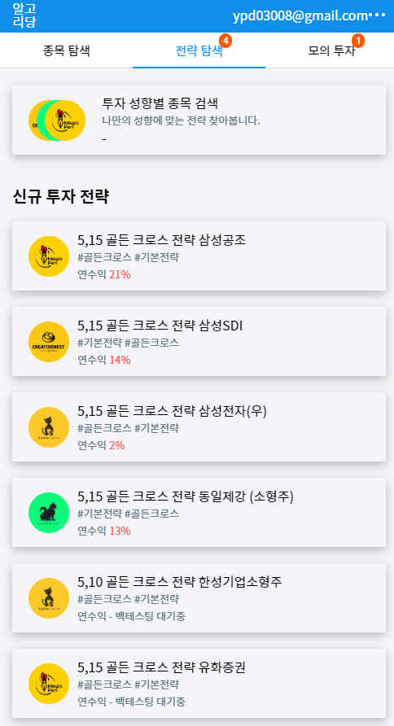
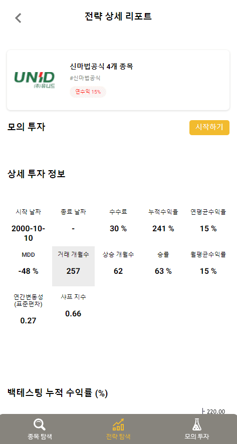
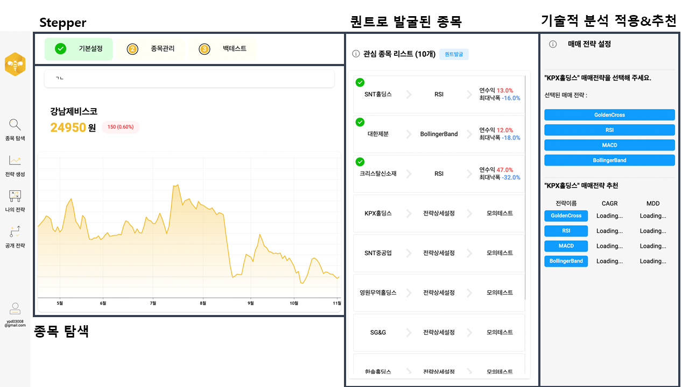
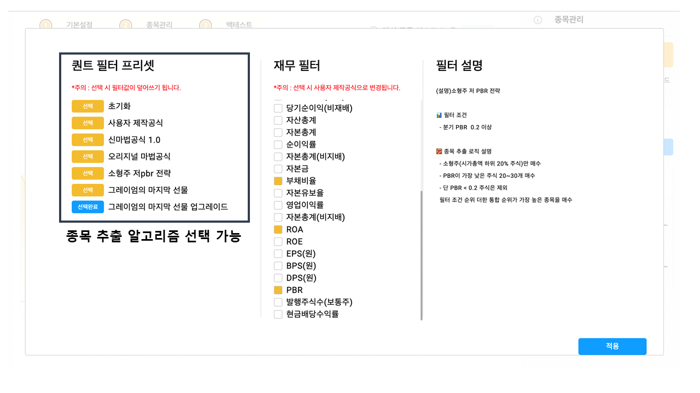
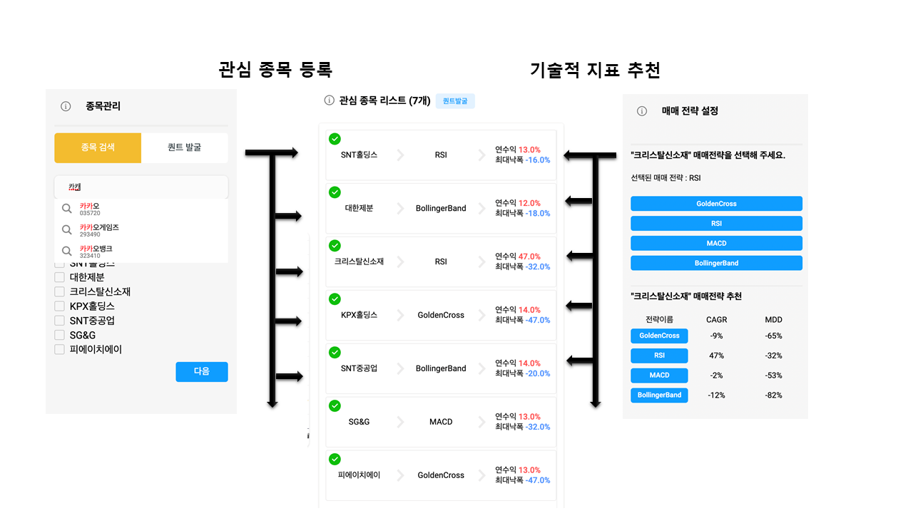
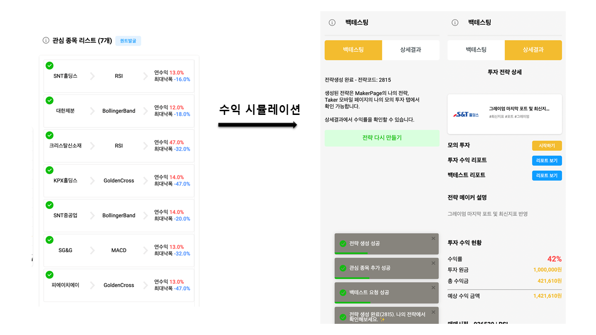

<div align="center">

# Welcome 알고리당 👏

## ReactJS 웹 클라이언트

<!--  -->

> 알고리당 서비스의 코드와 문서를 정리한 깃 레포 입니다.

[](#)
[](#)
[](#)
[](#)
[](#)
[](#)

</div>

<!-- COMMON-SECTION ABOUT THE PROJECT -->

## 알고리당 프로젝트 소개

> 퀀트 전략 설계를 통해 개인투자자들에게 일관적 투자성향을 제공하는 SW플랫폼

<br/>


"주식, 퀀트로 달콤해지다"
낮은 금융 지식이 요구되는 방식으로 누구나 퀀트 전략을 수립  
전략을 백테스트를 통해 검증하고, 자만의 퀀트 전략을 기반으로 알림 제공  
수익이 나는 자신만의 전략을 공유 및 판매를 할 수 있는 SW 플랫폼을 제공

<br/>

## 핵심 기능 개요

- [x] 전략 탐색 하기(Taker)
  - [x] 종목탐색
  - [x] 전략탐색
  - [x] 전략상세 보기 및 백테스트 결과
  - [x] 모의투자
  - [x] 퀀트 리포트

| 종목탐색                          | 전략탐색                          |
| --------------------------------- | --------------------------------- |
|  |  |

<br/>

| 전략상세 보기 및 백테스트 결과    | 모의투자                          |
| --------------------------------- | --------------------------------- |
|  |  |

<br/>

| 퀀트 리포트                       |
| --------------------------------- |
|  |

<br/>

- [x] 전략 생성 하기(Taker)
  - [x] 전략 생성 대시 보드
  - [x] 퀀트 발굴
  - [x] 매매 전략 설정 (기술적 지표 추천 )
  - [x] 백테스팅 및 미리보기

| 전략 생성 대시 보드                     |
| --------------------------------------- |
|  |

<br/>

| 퀀트 발굴                               |
| --------------------------------------- |
|  |

<br/>

| 매매 전략 설정 (기술적 지표 추천 )      |
| --------------------------------------- |
|  |

<br/>

| 백테스팅 및 미리보기                    |
| --------------------------------------- |
|  |

<br/>

## 주요 기능

- 투자전략 `생성대시보드` : 종목 (유니버스)에 투자 매매 전략 적용 시켜 `나만의 투자 알고리즘 생성`
- 투자종목 `퀀트 발굴` 기능 : `재무정보 기반`의 종목 발굴 기능
- 투자전략 `백테스트` : 알고리즘 `백테스트` 기능 ( 과거 데이터로 매매 시뮬레이션 )
- 투자전략 `퀀트리포트` : 백테스트 결과 `리포트` 처리
- 투자전략 `공유` : 선정된 종목과 매매전략 자체를 수요자에게 공유 가능
- 투자전략 `따라하기` : 수요자는 투자 전략을 탐색 및 모의투자 기능
- 투자전략 `성향별 분류` : 샤프 변동성을 기준으로 안정형, 중립형, 수익추구형 분류
- 구매한 전략 `모의투자` 기능 : 구매한 시점부터 현재까지 시뮬레이션 배치 기능

## 알고리당 주요 기술 과제

- [ TypeScript ] TS 기반의 `CBD` 기반의 리액트 클라이언트 및 DI 패턴의 비즈니스 `서버 아키텍처 설계`
- [ TypeScript ] Client 사이드에서 `Server 코드의 재사용` ( 예) Entity,DTO 부분 )
- [BE] 투자 전략 시뮬레이션 처리 안정성을 위해, 데이터 서버간 `Redis 메시지 큐` 도입
- [BE] 쿼리 지역성을 고려한 '가격 데이터 호출 부분' `Redis API Cache 적용`
- [BE] JWT 토큰 미들웨어 기반의 `Authentication` 및 Auth 데코레이터 기반의 `Authorization`
- [FE] `Recoil` 기반의 `중앙집중식 애러핸들링` 구현
- [FE] `React-Query` 기반의 `ServerState 캐시 관리` 및 `Hooks 모듈화`
- [FE] `Headless Components 구조` 도입으로, 구현층은 hook 및 표현층은 Presenter 컴포넌트로 분리
- [FE] `styled-components` 도입, 글로벌 CSS, 글로벌 Theming 변수
- [FE] 리랜더링 최소화 ( `메모이제이션` 및 `SSR` )
- [CI/CD] TestServer (Heroku, Netlify), ProdServer ( pipeline 구축 , TestCode, Docker 베포 )

## 알고리당 기술 블로그

https://velog.io/@ypd03008/series/%EC%95%8C%EA%B3%A0%EB%A6%AC%EB%8B%B9  
[](https://velog.io/@ypd03008/series/%EC%95%8C%EA%B3%A0%EB%A6%AC%EB%8B%B9)

<!-- INDIVIDUAL-SECTION ABOUT THE PROJECT -->

## React 주요 프로젝트 산출물

| 항목               | 설명                                                                | 링크                                                                          |
| ------------------ | ------------------------------------------------------------------- | ----------------------------------------------------------------------------- |
| IA feature.1       | https://www.notion.so/IA-feature-1-c9b17b3175f44bf89568b8629fe637f9 | [:link:](https://www.notion.so/IA-feature-1-c9b17b3175f44bf89568b8629fe637f9) |
| Kakao Oven         | https://ovenapp.io/view/LNFoHDLgOyH8tHCbjHU2MPApjlDtp6bL/           | [:link:](https://ovenapp.io/view/LNFoHDLgOyH8tHCbjHU2MPApjlDtp6bL/)           |
| UML-상태다이어그램 | https://www.notion.so/UML-c9e92ac8581b4377b0b5dc0180f8c27c          | [:link:](https://www.notion.so/UML-c9e92ac8581b4377b0b5dc0180f8c27c)          |

<div align="center">
<div align="center">

# Welcome 알고리당 👏

## NestJS 비즈니스 서버

<!--  -->

> 알고리당 서비스의 코드와 문서를 정리한 깃 레포 입니다.

[](#)
[](#)
[](#)

</div>

<!-- INDIVIDUAL-SECTION ABOUT THE PROJECT -->

## NestJS 프로젝트 산출물

| 항목      | 설명                                                          | 링크                                                                    |
| --------- | ------------------------------------------------------------- | ----------------------------------------------------------------------- |
| API 문서  | https://documenter.getpostman.com/view/11513933/TzsYPpy6      | [:link:](https://documenter.getpostman.com/view/11513933/TzsYPpy6)      |
| 서버 정책 | https://www.notion.so/06fa737b61934c1fac0efe5a11138950        | [:link:](https://www.notion.so/06fa737b61934c1fac0efe5a11138950)        |
| 단위 설계 | https://www.notion.so/feat01-91fd79e0c9054fe0bd5c2b576cfdb424 | [:link:](https://www.notion.so/feat01-91fd79e0c9054fe0bd5c2b576cfdb424) |

<!-- |awefawef|[](https://naver.com)|6|


  [](#)

  [](#)    -->

<!-- GETTING STARTED -->

<!-- Prerequisites -->

<!-- Installation -->

<!-- USAGE EXAMPLES -->

<!-- ROADMAP -->

<!-- LICENSE -->
<!-- ## License -->
<!-- Distributed under the MIT License. See `LICENSE` for more information. -->

## Installed Packaged

- package

```ts
typeorm @nestjs/typeorm pg chance
@nestjs/config cross-env joi jsonwebtoken bcrypt
class-transformer class-validator @nestjs/mapped-types
aws-sdk
@nestjs/bull bull cache-manager cache-manager-redis-store
@nestjs/passport passport passport-google-oauth20
@nestjs/graphql graphql apollo-server-express@2.x.x @apollo/gateway
ts-morph
```

- @types

```ts
-@types/bcrypt @types/jsonwebtoken
-@types/multer
-@types/passport-google-oauth20
-@types/bull @types/cache-manager @types/cache-manager-redis-store
```

### 커밋 규칙

| 규칙     | 설명                                 |
| -------- | ------------------------------------ |
| feat     | 새로운 기능에 대한 커밋              |
| fix      | 버그 수정에 대한 커밋                |
| build    | 빌드 관련 파일 수정에 대한 커밋      |
| chore    | 그 외 자잘한 수정에 대한 커밋        |
| ci       | CI관련 설정 수정에 대한 커밋         |
| docs     | 문서 수정에 대한 커밋                |
| style    | 코드 스타일 혹은 포맷 등에 관한 커밋 |
| refactor | 코드 리팩토링에 대한 커밋            |
| test     | 테스트 코드 수정에 대한 커밋         |

### 이슈 Label 규칙

| 접두어 | 내용         |
| ------ | ------------ |
| type   | todo💚       |
| type   | feature🎉    |
| type   | docs📄       |
| type   | QA🍶         |
| type   | bug🐞        |
| type   | discussion🔥 |
| type   | refactor🧬   |

## Contact

김도영 Kim Do Young - ypd03008@gmail.com
